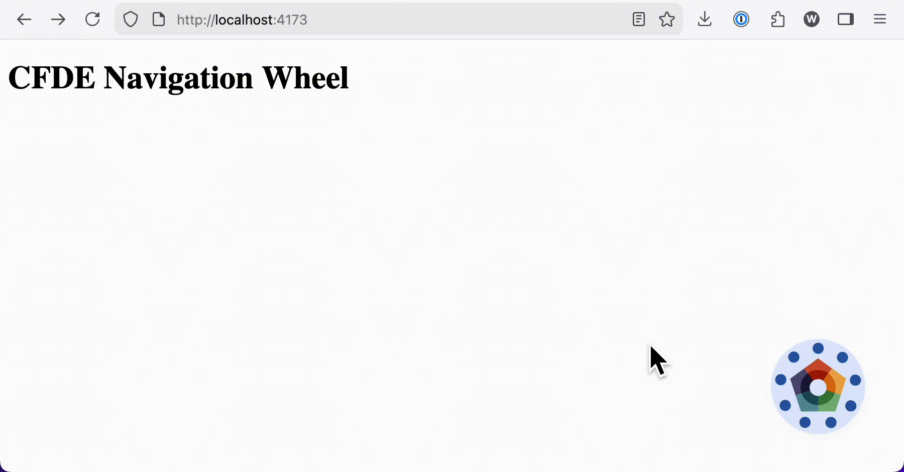

# CFDE Navigation Wheel Bundled Embed

This package builds a browser-ready bundle of [the CFDE Navigation Wheel component](https://github.com/MaayanLab/cfde-wheel) that can be embedded in any website via HTML.



## Use

### Basic Embed

Add this to your HTML page:

```html
<nav id="cfde-wheel"></nav>
<script src="path/to/cfde-wheel.iife.js"></script>
<!-- E.g. --><!--
<script>https://cdn.jsdelivr.net/gh/TACC/cfde-wheel-embed@v0.1.1/dist/cfde-wheel.iife.js"></script>
-->
```

The script will auto-initialize the wheel into the element with ID `cfde-wheel`.

### Manual Initialize

If you want to initialize the wheel manually or use a different container:

```html
<nav id="my-custom-container"></nav>
<script src="path/to/cfde-wheel.iife.js"></script>
<script>
  // EITHER initialize in a custom container
  window.CFDEWheel.init('my-custom-container');

  // OR pass the element directly
  // const container = document.getElementById('my-custom-container');
  // window.CFDEWheel.init(container);
</script>
```

## Develop

### Install

```bash
npm ci
```

### Build & Preview

```bash
npm start
```

OR

```bash
npm run build
npm run preview
```
